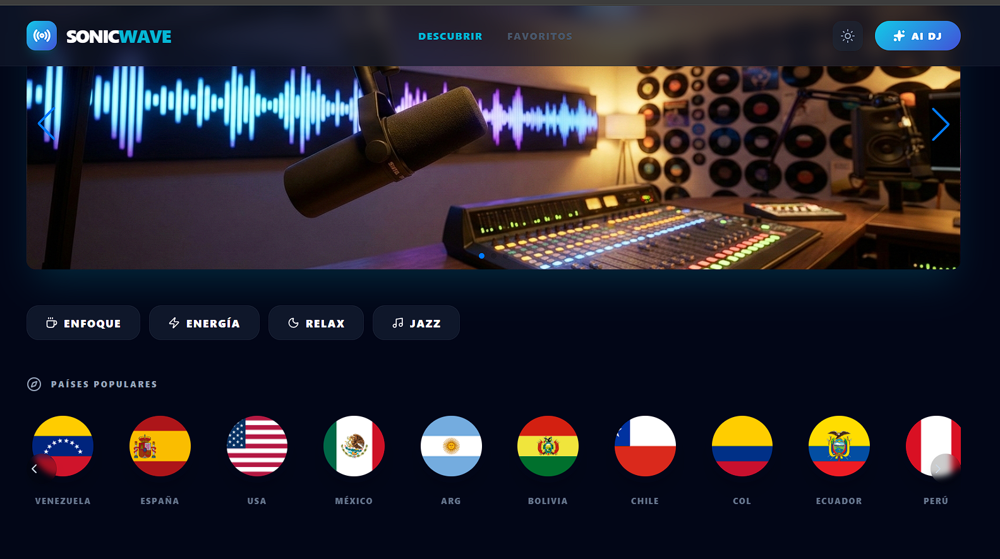
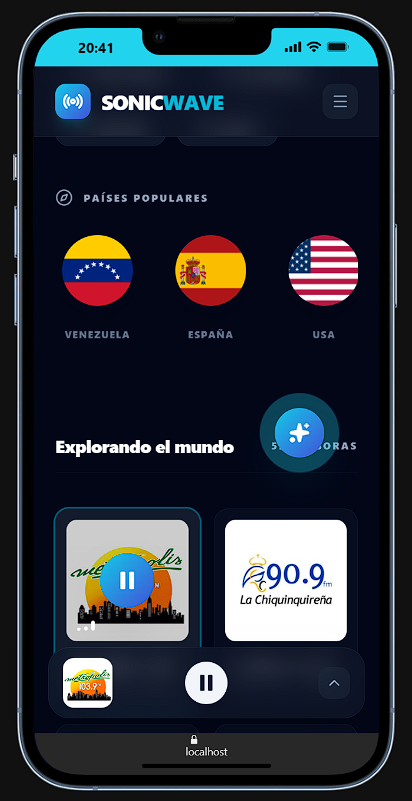

# 📻 SonicWave AI Radio

<div align="center">
  
</div>

## 🌟 Sintonizando el Futuro con IA

**SonicWave** es una experiencia de audio inmersiva que combina lo mejor de la radio global con la inteligencia artificial de última generación. No solo escuchas música; descubres ondas sonoras de todo el planeta guiado por un DJ inteligente impulsado por **Google Gemini**.

### 📸 Galería de la Interfaz
<div align="center">
  
  
</div>

---

### ✨ Características Principales

- **🤖 AI DJ con Gemini**: Pídele cualquier cosa al chatbot y deja que la IA busque emisoras por país, género o estado de ánimo. ¡Resultados dinámicos y explicados en español!
- **📊 Visualizador en Tiempo Real**: Siente el ritmo con un visualizador de espectro de audio profesional integrado en el reproductor.
- **🌍 +30.000 Emisoras**: Conexión directa con la Radio Browser API para acceder a radios de todos los continentes.
- **🎨 Diseño Premium "Vibe"**: Interfaz moderna con modo oscuro, degradados cian/indigo, animaciones fluidas y una experiencia móvil optimizada.
- **📱 PWA Ready**: Instala la aplicación en tu dispositivo móvil o escritorio para un acceso rápido y fluido.


---

### 🛠️ Stack Tecnológico

- **Framework**: React 19 + Vite
- **Estilos**: Tailwind CSS (Glassmorphism & Custom Animations)
- **IA**: Google Gemini Pro API
- **Audio**: Web Audio API (AnalyserNode)
- **Despliegue**: Vercel Serverless Functions

---

### 🚀 Instalación Local

1. **Clonar el repositorio**:
   ```bash
   git clone https://github.com/CARLOSNAMIAS/SonicWave.git
   cd SonicWave
   ```

2. **Instalar dependencias**:
   ```bash
   npm install
   ```

3. **Configurar variables de entorno**:
   Crea un archivo `.env.local` y añade tu clave de Gemini:
   ```env
   GEMINI_API_KEY=tu_clave_aqui
   ```

4. **Ejecutar en modo desarrollo**:
   ```bash
   npm run dev
   ```

---

### ⚖️ Licencia y Copyright
SonicWave es un agregador de contenido. Los derechos de las transmisiones pertenecen a sus respectivas emisoras. Creado por [CARLOSNAMIAS](https://github.com/CARLOSNAMIAS).
