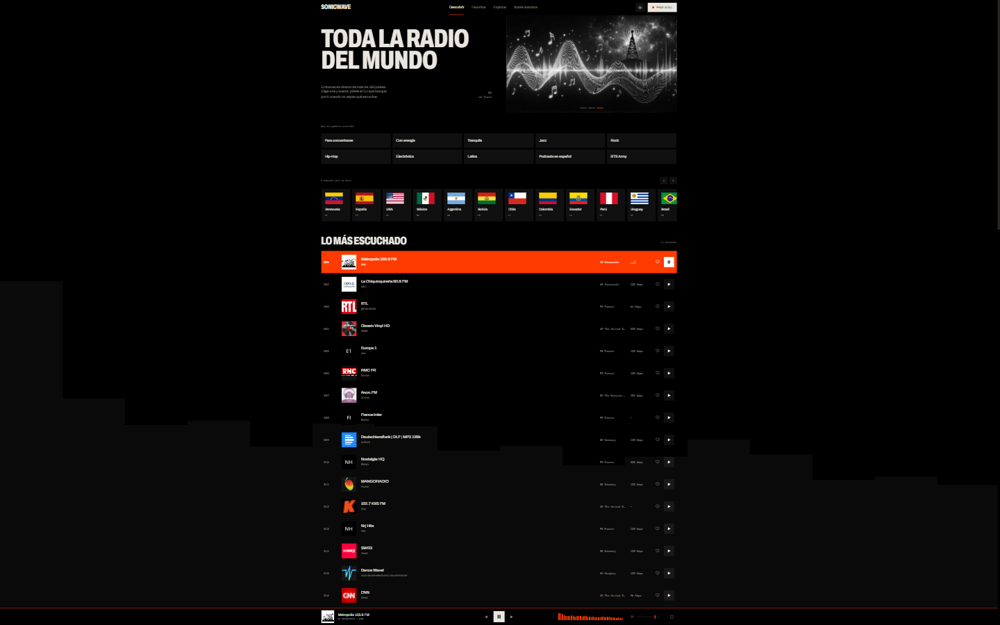
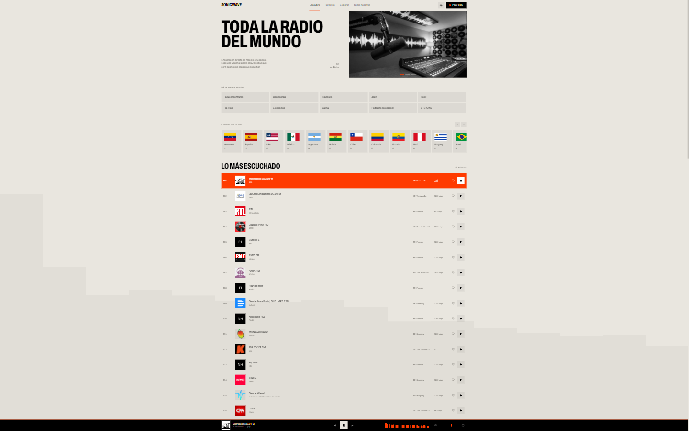
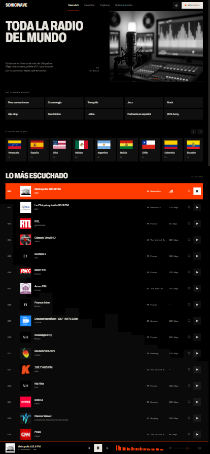

# SonicWave

Un índice de la radio pública mundial. Escribes lo que te apetece escuchar, un DJ
con IA busca entre miles de emisoras y te explica por qué eligió cada una.

**En directo:** [sonicwave-radio.vercel.app](https://sonicwave-radio.vercel.app/)



La emisora que suena invierte su fila sobre el color de señal. Es el único
momento en que aparece color en el listado: naranja significa siempre lo mismo,
"esto está sonando".

---

## Qué hace

- **Más de 30.000 emisoras** de 190 países, desde la base de datos comunitaria
  [Radio Browser](https://www.radio-browser.info/).
- **Un DJ que entiende frases.** «Algo tranquilo para trabajar» o «salsa pesada
  colombiana» se traducen en géneros y países concretos con **Google Gemini**, y
  el DJ cuenta en voz alta el porqué de su selección.
- **El sonido, a la vista.** El espectro de lo que suena se dibuja detrás de la
  página y en el reproductor, leído en tiempo real con la Web Audio API.
- **Sin cuenta ni registro.** Los favoritos y la preferencia de tema se guardan
  solo en tu navegador; no hay servidor que sepa quién eres.
- **Instalable** como aplicación (PWA) en móvil y escritorio.

<div align="center">
  
  
</div>

---

## Diseño

Negro, papel y una sola señal naranja. Sin degradados, sin sombras, sin esquinas
redondeadas y sin líneas divisorias: la jerarquía la marcan el tamaño del tipo y
el espacio en blanco.

| | |
|---|---|
| Titulares | Archivo, grotesca variable condensada al 70 % de anchura |
| Datos | IBM Plex Mono, con cifras tabulares para que las columnas cuadren |
| Color | `#000` tinta · `#E9E6DF` papel · `#FF3B00` señal |

El listado de emisoras es un índice: posición, carátula, nombre, procedencia y
calidad de transmisión alineados en columnas fijas.

---

## Stack

- **React 19** con **Vite 6** y TypeScript
- **Tailwind CSS 3** compilado con PostCSS (no por CDN: el sitio no depende de
  servicios externos para tener estilos)
- **Google Gemini** para la búsqueda en lenguaje natural
- **Web Audio API** (`AnalyserNode`) para el espectro
- **Vitest** + Testing Library
- Desplegado en **Vercel**, con funciones serverless en `api/` para hablar con
  Gemini y con Radio Browser sin exponer claves

---

## Instalación

```bash
git clone https://github.com/CARLOSNAMIAS/SonicWave.git
cd SonicWave
npm install
```

Crea un archivo `.env.local` con tu clave de Gemini:

```env
GEMINI_API_KEY=tu_clave_aqui
```

Y arranca el servidor de desarrollo:

```bash
npm run dev      # desarrollo en http://localhost:3000
npm run build    # compila a dist/
npm run preview  # sirve lo compilado
npm test         # batería de pruebas
```

> Si el puerto 3000 está ocupado, Vite salta a otro y lo anuncia en la consola;
> también puedes fijarlo con `npx vite --port 4321`.

---

## Estructura

```
src/
  components/     Reproductor, filas de emisora, DJ, fondo reactivo
  views/          Portada, favoritos, explorador por países, sobre, revista
  hooks/          Audio, favoritos, tema, voz y metadatos de página
  context/        Estado del reproductor compartido
  services/       Llamadas a Radio Browser y a Gemini
  data/           Emisoras venezolanas propias y textos por país y género
  lib/            Navegación por enlaces reales
api/              Funciones serverless (proxy de emisoras y del DJ)
public/           Páginas legales, iconos y ficheros del sitio
```

### Secciones desactivadas

La **Revista** está retirada de la navegación con el interruptor
`MAGAZINE_ENABLED` de `src/config.ts`. Su contenido se generaba con IA en cada
visita y las políticas de Google AdSense tratan el contenido generado
automáticamente como motivo de rechazo. El código de la vista se conserva
intacto: para recuperarla basta poner el interruptor en `true`, devolver su URL
al `sitemap.xml` y sustituir ese contenido por material editorial propio.

---

## Licencia y créditos

SonicWave es un agregador: **no aloja ninguna transmisión**. Cada señal viaja
directa desde el servidor de su emisora, y los derechos de cada emisión
pertenecen a sus titulares. Si representas a una emisora y quieres corregir o
retirar sus datos, [escríbenos](https://github.com/CARLOSNAMIAS).

Creado por [CARLOSNAMIAS](https://github.com/CARLOSNAMIAS).
